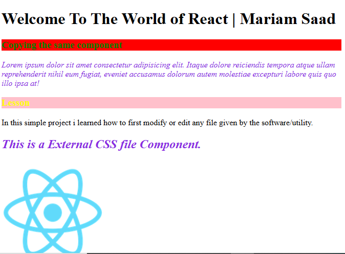
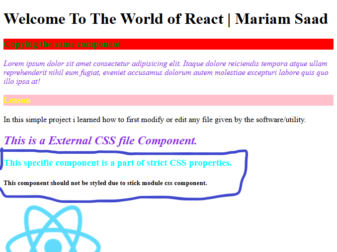

# EXTERNAL CSS APPLICATION 💻

#### In this method a seperate CSS FILE is created like here `App.css`but in the same folder where the application component exists and all the css styling must be mentioned in it. like below 👇

```
.test{
    font-style:italic;
    color: blueviolet;
}
```

```
function External() {
    return(
        <h2 className='test'>This is a External CSS file Component.</h2>
    );
}
export default External;
```

#### After that the jsx file like `External.jsx`is created in which the above `App.css`file is imported and the respective Class of the css `test`is injected in the html elements, like that `<h2 className='test'>This is a External CSS file Component.</h2>`. See the example below 👇


```
import ./App.css  

function External() {
    return(
        <h2 className='test'>This is a External CSS file Component.</h2>
    );
}
export default External;
```

#### And after that the `External.jsx` file must be imported into the main `App.jsx` file as well within the calling it.

**Note** 
* `.//ExternCSS/External`here the path must be given like this due to the different folder.

```
import External from './/ExternCSS/External'; 

function App() {
  const name = "Mariam Saad";
  return (
    <>
      <h1>Welcome To The World of React | {name}</h1>
       <External />
    </>
  );
}

export default App;
```


## APPLYING EXTERNAL CSS METHOD INTO OUTSIDE COMPONENTS

#### if we will apply the same CSS properties in other components as well, so we remove the above `import ./App.css`('./' this sign is for the same folder address) from the same above `External.jsx`component and this `App.css` must be imported to the main `App.jsx`file where other components'imports applied as well. For the clarification see the example below 👇


**Note** 
* `import './/ExternCSS/App.css` The file path must be like that due to different folder.

#### we can apply the external CSS in other components as well by importing it in the main App.jsx, and apply the (.)class in the respective components.

```
import InlineStyle from './InlineCSS/InlineStyle';
import NewInline from './InlineCSS/NewInline';
import External from './/ExternCSS/External'; 
import './/ExternCSS/App.css'

function App() {
  const name = "Mariam Saad";
  return (
    <>
      <h1>Welcome To The World of React | {name}</h1>
      <InlineStyle />
      <NewInline />
       <External />
    </>
  );
}

export default App;
```


#### Moreover, if want to add an image the image name and path be imported and its application along with any properties if any within the image tag ``.

```
import logo192 from './assets/logo192.png'

function App() {
  const name = "Mariam Saad";
  return (
    <>
      <h1>Welcome To The World of React | {name}</h1>
      
    </>
  );
}

export default App;

```

### THE RESULT

<div></div>


## MODULE-WISE CSS APPLICATION

#### if one want to specifically application any CSS CLASS in any specific component, and that class is already used in various components then we use the Module-wise css styling.


#### In the below 👇 file is created for the specific css application by the "Module-wise" 

**The following code's file name is `Stick.module.css`**
```
.retest {
    color: aqua;
    font-weight: bolder;
    
}
```
#### Now, the above CSS file is imported to the respective component. The css stylings be given here 👇.

**The following code's file name is `Stick.jsx`**

```
import styles from './stick.module.css'

function stick() {
    const name = "component";
    return(
        <h3 className={styles.retest}>This specific {name} is a part of strict CSS properties.</h3>

    );
}
export default stick;
```

#### And here the other component where the Class name is similar but due to only module-wise application, the class doesn't work in that `DualStick.jsx` component. 


```
function DualStick() {
    return(
        <h5 className="retest">This component should not be styled due to stick module css component.</h5>

    );
}
export default DualStick;
```

### THE RESULT

<div></div>

**NOTE**
* Do not forget to import all the jsx components into the main `App.jsx`file. Its a must.
See the all mentions in the main Readme file.


