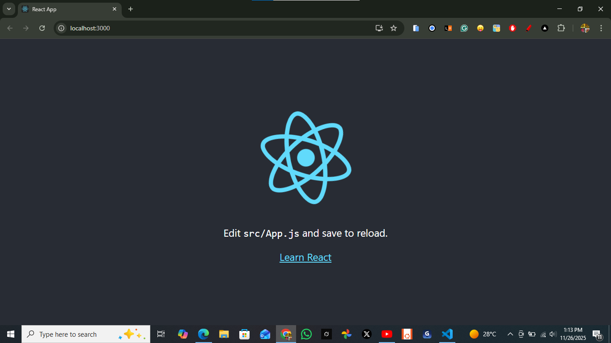
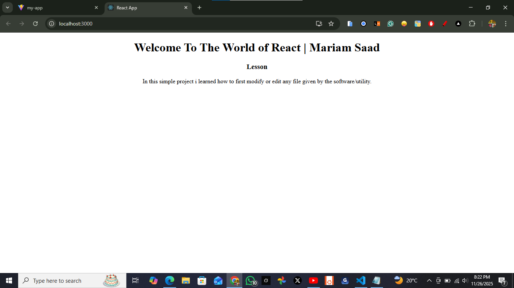
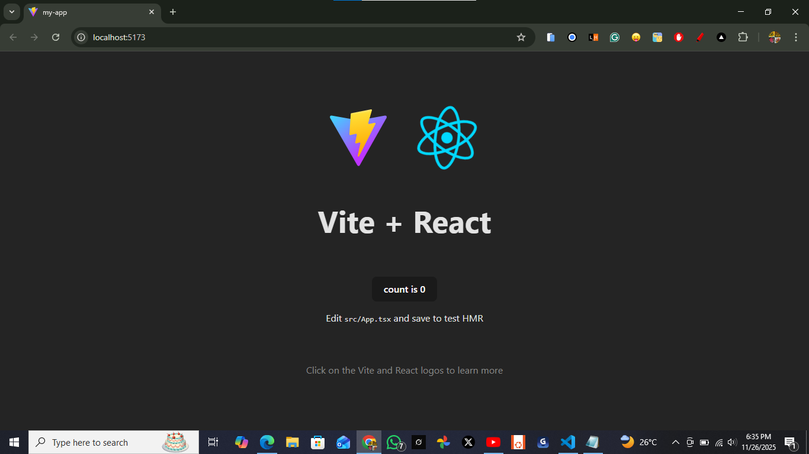
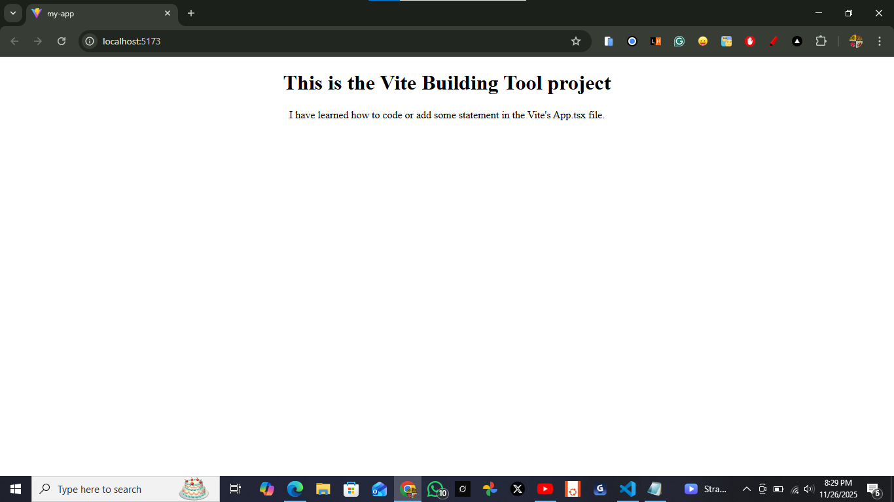
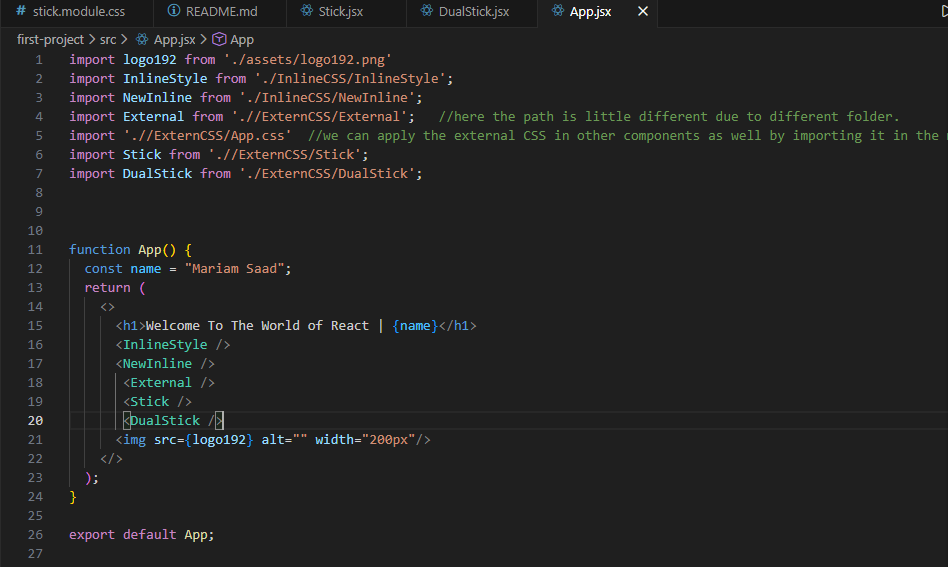

# REACT LEARNINGS
React is known as a SPA "Single Page Application" development. It also used to enhance the website loading speed and some very useful actions in it, like showing the increase of likes or share count in any website or social media platform as Facebook, Instagram, etc. **It mainly maintains the frontend efficiently.**


## HOW IT WORKS
#### It creates components, and make data if you need it, link the data and change whenever we want, above all it will actually react when the data change on the websites.


## WHEN TO USE REACT
#### It should be using when the big level project/website be created and where heavy amount of data(notification, reactions/likes), is travelling in real time and lots of reusable component are there.


## TERMONOLOGIES TO REMEMBER
**COMPONENT**
* Everything big, and has parts or repeative is called Component.
* The component can have data and it's data called State.
* If need change in the ready project then the change must be in the state, in resulting the component will automatically rechange it.
* Dataflow will work from parent to child component through props(properties).
* Effect is if something needs to modify or perform after the loading of DOM(the readiness of the website) then it will be happening by effect.
* `JSX` is similar to HTML, but afterwards it will convert in JavaScript. like in html, if write in between the `<div></div>` like that `<div>2+2</div>`then it will print the same `2+2` but if we write the same thing in the `JSX` component like this `<div>{2+2}</div>`then it will evaluate the value in it like that `4`. In short, in `JSX`we can calculate something simply like that within curly braces.


### EXAMPLES OF COMPONENT
* Navbar is a component
* Footer is a component.
* Cards in a website is a component, because its repeatable.
* Even a big area e.g Div that has various chunks inside it, is also called a component.


### PREREQUISITES
**EXTENSIONS TO INSTALL FOR THE BEST PERFORMANCE IN REACT.**
* Prettier.
* ES7 + React/Redux/React-Native snippets (by- dsznajder)
* ESlint (Integrates ESLint JavaScript into VS Code.)


## First-ever Basic Project of React


## STEP BY STEP PROCEDURE

**Install NODE.JS   (NODE PACKAGE MANAGER)**

**Create a folder**
In the local drive and open it via vs code editor then create a sub folder in it via

```
npm create-react-app first-project  -->enter
```
**To see the react library active**
```
cd first-project -->enter
npm run start   --->enter
```

**Result**
This command leads the react web-browser where we can see the active React interface with its logo.

```
Local:            http://localhost:3000        
On Your Network:  http://192.168.100.5:3000
```

<div>
</div>


#### Modification in the Project

* To edit and start experiencing in this basic react project we open the App.js file and delete everything except the block of code like;

```
function App() {
  return (
    
  );
}

export default App;
```
and in this above code we write some statement under the "return" of our preference like;

```
function App() {
  return (
    <center>
    <h1>Welcome To The World of React | Mariam Saad</h1>
    <p><h3>Lesson</h3>In this simple project i learned how to first modify or edit any file given by the software/utility.</p>
    </center>
  );
}

export default App;
```

##### And it will look like

<div></div>


### Start building in it

**on the same folder**
```
npm run build    --->enter
```
**Result**
* It will create a folder called "build" automatically within sub folder and files.
* It builds only one time though out the project.

## Why Build Folder creation
Because in the production side we only face and most working in the build folder as a Head folder where we have the Javascript, and other important files to work on.

### Notice
The project called "build" and running the basic browser is a bulky and time-consuming that's why we don't use it much more.

* For building projects we mostly use the mentioned tools below.


## Build a React app from Scratch
If your app has constraints not well-served by existing frameworks, you prefer to build your own framework, or you just want to learn the basics of a React app, you can build a React app from scratch.

## TOOL FOR CREATE REACT APP FROM SCRATCH
### VITE
#### As we don't need to code the whole stuff in react so for this purpose we use Vite tool that enables us to write code in React in a shorter form.

* It will also helps to create a raw React app means, without taking help of any other library or tool for example Next.js, etc.

### PREREQUISITES
* `VITE` Installed
* `NPM` Package Installed

### Step 1: Install a build tool 
The first step is to install a build tool like `vite`, `parcel`, or `rsbuild`. These build tools provide features to package and run source code, provide a development server for local development and a build command to deploy your app to a production server.

<p><a href="https://vite.dev/">1- Vite</a></p>

Vite is a build tool that aims to provide a faster and leaner development experience for modern web projects.


### DEFAULT CODE
* The codes that are providing by the tools or software themselves to run or create a project are called **Default Code**. Examples are shown below.

```
npm create vite@latest my-app -- --template react-ts
cd my-app
npm run dev
npm run build
npm run start
```

**For writing or starting anything within Vite tool, we create a app by installing the vite bundler and then create an app like this;**


```
npm create vite@latest my-app -- --template react-ts

```
This above command will be found from the Vite Website integrated with the React.dev. And it is seen that it has already a project name "my-app". 

After that you will see the project folder on the navigation bar. The project's important components will be found and seen in the "Package.json" file. 

* Now, to get the project's information we can look that in the "Package.json" file;

```
"name": "my-app",
  "private": true,
  "version": "0.0.0",
  "type": "module",
  ```
  * Here we can see the project name, status, version, and type.

  ```
  "scripts":
    "dev": "vite",
    "build": "tsc -b && vite build",
    "lint": "eslint .",
    "preview": "vite preview"
    ```
  * Here how we can deal with the project like the vite project should run with "npm run dev" command, to build anything we say "npm run build", "lint" is like an error that is seen in the project code, and 'preview" is for seeing the project running.

  ```
  dependencies":
    "react": "^19.2.0",
    "react-dom": "^19.2.0"
    ```

  * "dependencies" called actually a libraries that have been given here like "react" with its version and "react-dom" and its version as well.

```
"devDependencies": {
    "@eslint/js": "^9.39.1",
    "@types/node": "^24.10.1",
    "@types/react": "^19.2.5",
    "@types/react-dom": "^19.2.3",
    "@vitejs/plugin-react": "^5.1.1",
    "eslint": "^9.39.1",
    "eslint-plugin-react-hooks": "^7.0.1",
    "eslint-plugin-react-refresh": "^0.4.24",
    "globals": "^16.5.0",
    "typescript": "~5.9.3",
    "typescript-eslint": "^8.46.4",
    "vite": "^7.2.4"
  }
  ```
  * Finally, these are just useful for the developing the project not giving to the production side or client side. (if they exist then ok, and if not then still is ok.)


#### To Preview the basic Vite Project

**Write in the Terminal**

1- Navigate to the project folder

```
cd my-app
```

2- Then, in the exact folder run this command, this command (npm run dev) is specified for only the Vite's applications.

```
npm run dev
```

**And finally you will see**

<div></div>


**Note**
The above command will not only create an app but also install the Vite package as well.
(we can also delete some unwanted files for lightening our project like, App.css, index.css, logos, etc)


### To Edit/modify the existent Project

Afterwards, **notably**, in the App.tsx file we delete everything except the code that i will be writing below along with some testing code like `<h1>Welcome To The React World</h1>`. And finally the full code block will be;

```
function App() {
  return (
    <h1>Welcome To the Vite Tool World</h1>
  )
}

export default App

```

#### Afterwards
**Important**
we must navigate to the vite created folder through the terminal that is here my-app.
```
cd my-app
```
After this, run command to see the code changes in the browser like;
```
npm run dev
```

#### Result
* After the modification you will see the modified project in the browser like;

<div></div>


**NOTE**
* Do not forget to import all the jsx components into the main `App.jsx`file. Its a must.
See the all mentions in the main Readme file.
* If the CSS file be created then each folder has to be its own.
* rfce ---(shortcut for creating the whole component function along with div tag and import it, after creating its file.)

**Like this 👇**
<div></div>


### Summary

* I learned how to work in editing or modificating in the default project given by the React and Vite and how to clean the project from unwanted files. And finally, how to start writing my own code in it.
